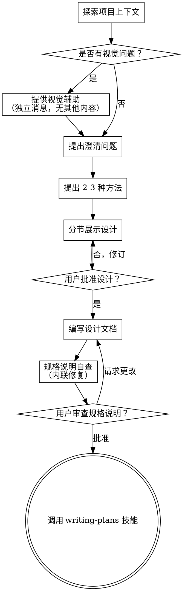

# 将创意转化为设计

通过自然的协作对话，帮助将创意转化为成熟的设计和规格说明。

首先了解当前的项目上下文，然后逐一提出问题以完善创意。一旦明确了构建目标，就展示设计方案并获取用户批准。

<硬门控>
在展示设计方案并获得用户批准之前，**不得**调用任何实现技能、编写任何代码、搭建任何项目或采取任何实现行动。这适用于**所有**项目，无论其看似多么简单。
</硬门控>

## 反模式：“这太简单了，不需要设计”

每个项目都要经过此流程。无论是待办事项列表、单函数工具，还是配置更改——无一例外。“简单”的项目往往因为未经审视的假设而导致最多的无效工作。设计可以很简短（对于真正简单的项目，只需几句话），但你**必须**展示它并获得批准。

## 检查清单

你必须为以下每项创建一个任务，并按顺序完成：

1. **探索项目上下文** — 检查文件、文档、最近的提交
2. **提供视觉辅助**（如果主题涉及视觉问题）— 这是一条独立的消息，不与澄清问题合并。参见下方的“视觉辅助”部分。
3. **提出澄清问题** — 一次一个，理解目的/约束/成功标准
4. **提出 2-3 种方法** — 包含权衡利弊及你的推荐
5. **展示设计** — 按复杂度分节展示，每节后获取用户批准
6. **编写设计文档** — 保存至 `docs/superpowers/specs/YYYY-MM-DD-<主题>-design.md` 并提交
7. **规格说明自查** — 快速内联检查占位符、矛盾、歧义、范围（见下文）
8. **用户审查书面规格说明** — 在继续之前，请用户审查规格说明文件
9. **过渡到实现** — 调用 writing-plans 技能以创建实现计划

## 流程图解

**终止状态是调用 writing-plans。** 不要调用 frontend-design、mcp-builder 或任何其他实现技能。头脑风暴后调用的**唯一**技能是 writing-plans。

## 流程详情

**理解创意：**

- 首先检查当前项目状态（文件、文档、最近的提交）
- 在询问详细问题之前，评估范围：如果请求描述了多个独立的子系统（例如，“构建一个包含聊天、文件存储、计费和数据分析的平台”），请立即标记。不要花费时间去细化一个需要先分解的项目的细节。
- 如果项目太大，无法用单个规格说明涵盖，帮助用户将其分解为子项目：有哪些独立的部分，它们如何关联，应按什么顺序构建？然后通过正常的设计流程对第一个子项目进行头脑风暴。每个子项目都有自己的规格说明 → 计划 → 实现循环。
- 对于范围适当的项目，逐一提出问题以完善创意
- 尽可能偏好多项选择题，但开放式问题也可以
- 每条消息只提一个问题 - 如果一个主题需要更多探索，将其拆分为多个问题
- 重点关注理解：目的、约束、成功标准

**探索方法：**

- 提出 2-3 种不同的方法及其权衡利弊
- 以对话方式呈现选项，附上你的推荐和理由
- 优先展示你推荐的选项并解释原因

**展示设计：**

- 一旦你认为自己理解了要构建的内容，就展示设计
- 根据复杂度调整每部分的篇幅：如果直截了当，只需几句话；如果细微复杂，可达 200-300 字
- 每部分之后询问目前看起来是否正确
- 涵盖：架构、组件、数据流、错误处理、测试
- 如果某些地方不清楚，准备好返回并进行澄清

**为隔离性和清晰度而设计：**

- 将系统划分为更小的单元，每个单元都有单一明确的目的，通过定义良好的接口进行通信，并且可以独立理解和测试
- 对于每个单元，你应该能够回答：它做什么，如何使用它，以及它依赖什么？
- 人们能否在不阅读内部实现的情况下理解单元的功能？你能否在不破坏使用者的情况下更改内部实现？如果不能，则边界需要改进。
- 更小、边界清晰的单元也更容易让你处理——你能更好地推理那些可以一次性放入上下文中的代码，并且当文件专注时，你的编辑更可靠。当文件变得过大时，这通常是一个信号，表明它承担了过多的职责。

**在现有代码库中工作：**

- 在提出更改之前探索当前结构。遵循现有模式。
- 如果现有代码存在影响工作的问题（例如，文件过大、边界不清、职责纠缠），将这些有针对性的改进纳入设计中——就像优秀的开发者在改进他们正在处理的代码时所做的那样。
- 不要提出无关的重构。专注于服务于当前目标的内容。

## 设计之后

**文档化：**

- 将验证后的设计（规格说明）写入 `docs/superpowers/specs/YYYY-MM-DD-<主题>-design.md`
  - （用户对规格说明位置的偏好优先于此默认设置）
- 如果可用，使用 elements-of-style:writing-clearly-and-concisely 技能
- 将设计文档提交到 git

**规格说明自查：**
撰写完规格说明文档后，以全新的视角审视它：

1. **占位符扫描：** 是否有任何“TBD”、“TODO”、未完成的章节或模糊的需求？修复它们。
2. **内部一致性：** 各章节之间是否存在矛盾？架构是否与功能描述匹配？
3. **范围检查：** 这是否足够聚焦，可以纳入单个实现计划，还是需要分解？
4. **歧义检查：** 是否有任何需求可以被两种不同的方式解释？如果是，选择一种并使其明确。

内联修复任何问题。无需重新审查——只需修复并继续。

**用户审查关口：**
在规格说明审查循环通过后，请用户在继续之前审查书面规格说明：

> “规格说明已撰写并提交至 `<路径>`。请审查它，并在我们开始编写实现计划之前告诉我是否需要进行任何更改。”

等待用户的回复。如果他们请求更改，请进行修改并重新运行规格说明审查循环。仅在用户批准后继续。

**实现：**

- 调用 writing-plans 技能以创建详细的实现计划
- **不要**调用任何其他技能。writing-plans 是下一步。

## 关键原则

- **一次一个问题** - 不要用多个问题让用户不知所措
- **偏好多项选择** - 在可能的情况下，比开放式问题更容易回答
- **无情地践行 YAGNI（你不需要它）** - 从所有设计中移除不必要的功能
- **探索替代方案** - 在确定之前，始终提出 2-3 种方法
- **增量验证** - 展示设计，在继续之前获得批准
- **保持灵活** - 当某些地方不清楚时，返回并进行澄清

## 视觉辅助

一个基于浏览器的辅助工具，用于在头脑风暴期间展示模型、图表和视觉选项。作为一种工具提供——不是一种模式。接受该辅助意味着它在受益于视觉处理的问题中可用；这**并不**意味着每个问题都要通过浏览器进行。

**提供辅助：** 当你预见到即将到来的问题将涉及视觉内容（模型、布局、图表）时，一次性征求同意：

> “我们正在处理的一些内容如果我在网络浏览器中展示给你看，可能会更容易解释。我可以随着进程提供模型、图表、比较和其他视觉效果。此功能尚新且可能消耗大量 token。想试试吗？（需要打开本地 URL）”

**此提议必须是独立的消息。** 不要将其与澄清问题、上下文总结或任何其他内容合并。该消息应**仅**包含上述提议，别无其他。在继续之前等待用户的回复。如果他们拒绝，则继续进行纯文本头脑风暴。

**每问决策：** 即使用户接受了辅助，也要**针对每个问题**决定是使用浏览器还是终端。测试标准是：**用户通过观看是否比通过阅读能更好地理解？**

- **使用浏览器** 处理**视觉性**内容 — 模型、线框图、布局比较、架构图、并排视觉设计
- **使用终端** 处理**文本性**内容 — 需求问题、概念选择、权衡列表、A/B/C/D 文本选项、范围决策

关于 UI 主题的问题并不自动成为视觉问题。“在这种情况下‘个性’意味着什么？”是一个概念性问题 — 使用终端。“哪个向导布局效果更好？”是一个视觉性问题 — 使用浏览器。

如果他们同意使用辅助，请在继续之前阅读详细指南：
`skills/brainstorming/visual-companion.md`
