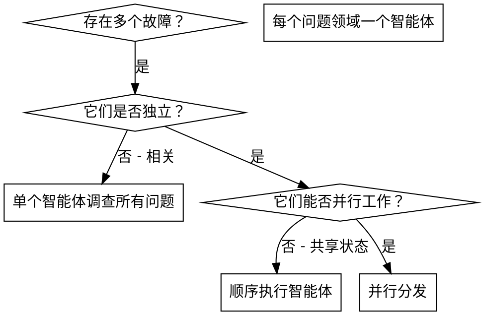

# 分发并行智能体

## 概述

你将任务委托给具有隔离上下文的专用智能体。通过精心构建它们的指令和上下文，确保它们保持专注并成功完成任务。它们绝不应继承你会话的上下文或历史——你需精确构建它们所需的内容。这也为你保留了用于协调工作的上下文。

当你面临多个不相关的故障（不同的测试文件、不同的子系统、不同的 bug）时，按顺序调查会浪费时间。每次调查都是独立的，可以并行进行。

**核心原则：** 为每个独立的问题领域分发一个智能体。让它们并发工作。

## 何时使用



**适用场景：**

- 3 个或更多测试文件因不同根本原因而失败
- 多个子系统独立损坏
- 理解每个问题无需依赖其他问题的上下文
- 各次调查之间无共享状态

**不适用场景：**

- 故障相互关联（修复一个可能同时修复其他）
- 需要理解完整的系统状态
- 智能体之间会相互干扰

## 模式步骤

### 1. 识别独立领域

按故障类型对问题进行分组：

- 文件 A 测试：工具审批流程
- 文件 B 测试：批量完成行为
- 文件 C 测试：中止功能

每个领域都是独立的——修复工具审批不会影响中止测试。

### 2. 创建聚焦的智能体任务

每个智能体获得：

- **特定范围：** 一个测试文件或子系统
- **明确目标：** 让这些测试通过
- **约束条件：** 不要更改其他代码
- **预期输出：** 发现问题和修复内容的摘要

### 3. 并行分发

```typescript
// 在 Claude Code / AI 环境中
Task('修复 agent-tool-abort.test.ts 中的失败用例');
Task('修复 batch-completion-behavior.test.ts 中的失败用例');
Task('修复 tool-approval-race-conditions.test.ts 中的失败用例');
// 三者并发运行
```

### 4. 审查与集成

当智能体返回结果时：

- 阅读每份摘要
- 验证修复内容不存在冲突
- 运行完整测试套件
- 集成所有更改

## 智能体提示词结构

优秀的智能体提示词应具备：

1. **聚焦** - 针对一个清晰的问题领域
2. **自包含** - 包含理解问题所需的所有上下文
3. **明确输出要求** - 智能体应返回什么？

```markdown
修复 src/agents/agent-tool-abort.test.ts 中失败的 3 个测试：

1. "should abort tool with partial output capture" - 期望消息中包含 'interrupted at'
2. "should handle mixed completed and aborted tools" - 快速工具被中止而非完成
3. "should properly track pendingToolCount" - 期望得到 3 个结果但实际得到 0

这些是时序/竞态条件问题。你的任务：

1. 阅读测试文件，理解每个测试验证的内容
2. 确定根本原因 - 是时序问题还是实际 bug？
3. 通过以下方式进行修复：
   - 用基于事件的等待替换任意超时
   - 如果发现中止实现中存在 bug，则进行修复
   - 如果测试行为已变更，则调整测试预期

切勿仅仅增加超时时间——要找到真正的问题所在。

返回：你发现的问题及修复内容的摘要。
```

## 常见错误

**❌ 范围过宽：** “修复所有测试” - 智能体会迷失方向
**✅ 具体明确：** “修复 agent-tool-abort.test.ts” - 范围聚焦

**❌ 缺乏上下文：** “修复竞态条件” - 智能体不知道位置
**✅ 提供上下文：** 粘贴错误信息和测试名称

**❌ 无约束条件：** 智能体可能会重构所有内容
**✅ 设定约束：** “不得更改生产代码” 或 “仅修复测试”

**❌ 输出模糊：** “修复它” - 你不知道发生了什么变化
**✅ 明确要求：** “返回根本原因和更改内容的摘要”

## 何时不使用

**相关故障：** 修复一个可能修复其他——先一起调查
**需要完整上下文：** 理解问题需要查看整个系统
**探索性调试：** 尚不清楚哪里出了问题
**共享状态：** 智能体会相互干扰（编辑相同文件、使用相同资源）

## 会话中的真实示例

**场景：** 重大重构后，3 个文件中出现 6 个测试失败

**失败情况：**

- agent-tool-abort.test.ts: 3 个失败（时序问题）
- batch-completion-behavior.test.ts: 2 个失败（工具未执行）
- tool-approval-race-conditions.test.ts: 1 个失败（执行计数 = 0）

**决策：** 属于独立领域——中止逻辑、批量完成和竞态条件彼此分离

**分发：**

```
智能体 1 → 修复 agent-tool-abort.test.ts
智能体 2 → 修复 batch-completion-behavior.test.ts
智能体 3 → 修复 tool-approval-race-conditions.test.ts
```

**结果：**

- 智能体 1：用基于事件的等待替换了超时
- 智能体 2：修复了事件结构 bug（threadId 位置错误）
- 智能体 3：添加了等待异步工具执行完成的逻辑

**集成：** 所有修复相互独立，无冲突，完整测试套件通过

**节省时间：** 并行解决 3 个问题 vs 顺序解决

## 主要优势

1. **并行化** - 多次调查同时发生
2. **专注** - 每个智能体范围狭窄，需跟踪的上下文更少
3. **独立性** - 智能体之间互不干扰
4. **速度** - 解决 3 个问题的时间等同于解决 1 个问题

## 验证

智能体返回后：

1. **审查每份摘要** - 理解更改内容
2. **检查冲突** - 智能体是否编辑了相同代码？
3. **运行完整套件** - 验证所有修复协同工作正常
4. **抽查** - 智能体可能会犯系统性错误

## 现实世界影响

来自调试会话（2025-10-03）：

- 3 个文件中共有 6 个失败
- 并行分发了 3 个智能体
- 所有调查并发完成
- 所有修复成功集成
- 智能体之间的更改零冲突
