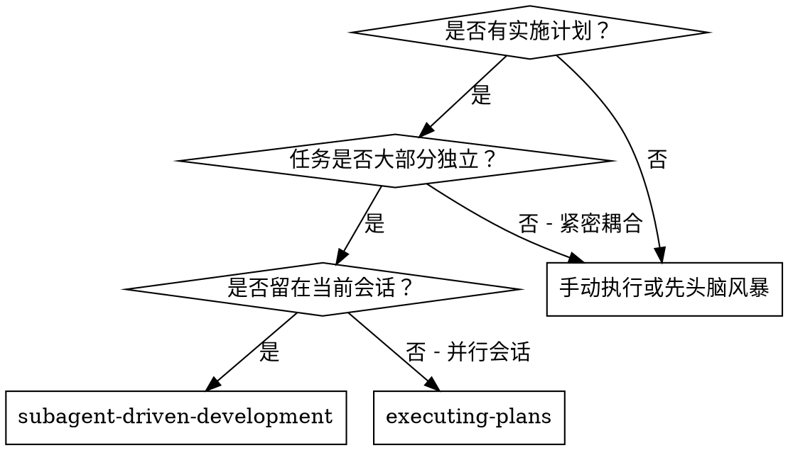
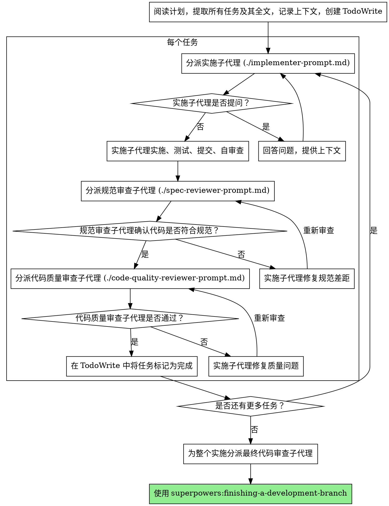

# 子代理驱动开发

通过为每个任务分派全新的子代理来执行计划，每个任务后进行两阶段审查：先进行规范合规审查，再进行代码质量审查。

**使用子代理的原因：**你将任务委派给具有隔离上下文的专门子代理。通过精确设计它们的指令和上下文，确保它们保持专注并成功完成任务。它们绝不应继承你本次会话的上下文或历史——你只需要构建它们所需的精确内容。这也能为你自己的协调工作保留上下文。

**核心原则：**每个任务使用全新的子代理 + 两阶段审查（先规范后质量） = 高质量、快速迭代

## 使用场景



**与执行计划（并行会话）对比：**

- 同一会话（无需切换上下文）
- 每个任务使用全新的子代理（无上下文污染）
- 每个任务后进行两阶段审查：先规范合规，再代码质量
- 更快的迭代（任务之间无需人工介入）

## 流程



## 模型选择

对每个角色使用能够胜任的最弱模型，以节省成本并提高速度。

**机械性实施任务**（独立函数、明确规范、涉及1-2个文件）：使用快速、便宜的模型。当计划详细说明时，大多数实施任务都是机械性的。

**集成和判断任务**（多文件协调、模式匹配、调试）：使用标准模型。

**架构、设计和审查任务**：使用能力最强的可用模型。

**任务复杂性指标：**

- 涉及1-2个文件且规范完整 → 便宜模型
- 涉及多个文件且有集成问题 → 标准模型
- 需要设计判断或广泛的代码库理解 → 能力最强的模型

## 处理实施子代理状态

实施子代理会报告四种状态之一。对每种状态进行相应处理：

**DONE：**继续进行规范合规审查。

**DONE_WITH_CONCERNS：**实施子代理已完成工作但标记了疑虑。在继续之前，请先阅读这些疑虑。如果疑虑是关于正确性或范围的，在审查前解决它们。如果只是观察结果（例如：“此文件正在变大”），记录下来并继续审查。

**NEEDS_CONTEXT：**实施子代理需要未提供的信息。提供缺失的上下文并重新分派。

**BLOCKED：**实施子代理无法完成任务。评估阻塞原因：

1. 如果是上下文问题，提供更多上下文并使用同一模型重新分派
2. 如果任务需要更多推理，使用能力更强的模型重新分派
3. 如果任务太大，将其拆分为更小的部分
4. 如果计划本身有误，向人工用户升级

**绝不**忽略升级请求，或强制同一模型在不做更改的情况下重试。如果实施子代理说它卡住了，说明某些地方需要改变。

## 提示模板

- `./implementer-prompt.md` - 分派实施子代理
- `./spec-reviewer-prompt.md` - 分派规范合规审查子代理
- `./code-quality-reviewer-prompt.md` - 分派代码质量审查子代理

## 示例工作流

```
你：我正在使用子代理驱动开发来执行此计划。

[读取一次计划文件：docs/superpowers/plans/feature-plan.md]
[提取全部5个任务及其全文和上下文]
[创建包含所有任务的 TodoWrite]

任务1：钩子安装脚本

[获取任务1的文本和上下文（已提取）]
[用完整的任务文本和上下文分派实施子代理]

实施子代理：“在我开始之前——钩子应该安装在用户级别还是系统级别？”

你：“用户级别 (~/.config/superpowers/hooks/)”

实施子代理：“明白了。现在开始实施……”
[稍后] 实施子代理：
  - 实现了 install-hook 命令
  - 添加了测试，5/5 通过
  - 自审查：发现我漏掉了 --force 标志，已添加
  - 已提交

[分派规范合规审查子代理]
规范审查子代理：✅ 符合规范 - 满足所有要求，无多余内容

[获取 git SHAs，分派代码质量审查子代理]
代码审查子代理：优点：良好的测试覆盖率，干净。问题：无。已通过。

[将任务1标记为完成]

任务2：恢复模式

[获取任务2的文本和上下文（已提取）]
[用完整的任务文本和上下文分派实施子代理]

实施子代理：[无问题，继续进行]
实施子代理：
  - 添加了 verify/repair 模式
  - 8/8 测试通过
  - 自审查：一切正常
  - 已提交

[分派规范合规审查子代理]
规范审查子代理：❌ 问题：
  - 缺少：进度报告（规范说“每100项报告一次”）
  - 多余：添加了 --json 标志（非请求内容）

[实施子代理修复问题]
实施子代理：移除了 --json 标志，添加了进度报告

[规范审查子代理再次审查]
规范审查子代理：✅ 现在符合规范

[分派代码质量审查子代理]
代码审查子代理：优点：可靠。问题（重要）：魔法数字 (100)

[实施子代理修复]
实施子代理：提取了 PROGRESS_INTERVAL 常量

[代码审查子代理再次审查]
代码审查子代理：✅ 已通过

[将任务2标记为完成]

……

[所有任务完成后]
[分派最终代码审查子代理]
最终审查子代理：满足所有要求，准备合并

完成！
```

## 优势

**对比手动执行：**

- 子代理自然地遵循 TDD
- 每个任务都有全新的上下文（无混淆风险）
- 并行安全（子代理之间不互相干扰）
- 子代理可以提问（在开始工作前和工作期间均可）

**对比执行计划：**

- 同一会话（无需交接）
- 持续进展（无需等待）
- 自动审查检查点

**效率提升：**

- 无文件读取开销（控制者提供全文）
- 控制者精确策划所需的上下文
- 子代理预先获得完整信息
- 问题在工作开始前被提出（而非开始后）

**质量关卡：**

- 自审查在移交前发现问题
- 两阶段审查：先规范合规，再代码质量
- 审查循环确保修复确实有效
- 规范合规防止过度构建或构建不足
- 代码质量确保实现方式良好

**成本：**

- 更多的子代理调用（每个任务需实施子代理 + 2个审查子代理）
- 控制者需做更多准备工作（预先提取所有任务）
- 审查循环增加迭代次数
- 但能尽早发现问题（比后期调试成本更低）

## 红线

**绝不：**

- 在没有明确用户同意的情况下在 main/master 分支上开始实施
- 跳过审查（规范合规或代码质量）
- 在问题未修复的情况下继续
- 并行分派多个实施子代理（会产生冲突）
- 让子代理读取计划文件（应提供全文）
- 跳过设定场景的上下文（子代理需要理解任务所处的位置）
- 忽略子代理的问题（在让它们继续前先回答）
- 在规范合规上接受“差不多”（规范审查子代理发现问题 = 未完成）
- 跳过审查循环（审查子代理发现问题 = 实施子代理修复 = 再次审查）
- 让实施子代理的自审查取代实际审查（两者都需要）
- **在规范合规确认为 ✅ 之前开始代码质量审查**（顺序错误）
- 在任一审查存在未决问题时进入下一个任务

**如果子代理提问：**

- 清晰、完整地回答
- 如有需要，提供额外上下文
- 不要催促它们开始实施

**如果审查子代理发现问题：**

- 实施子代理（同一个）修复它们
- 审查子代理再次审查
- 重复直至通过
- 不要跳过再次审查

**如果子代理任务失败：**

- 使用特定指令分派修复子代理
- 不要尝试手动修复（会污染上下文）

## 集成

**必需的工作流技能：**

- **superpowers:using-git-worktrees**——必需：在开始前设置隔离的工作空间
- **superpowers:writing-plans**——创建此技能要执行的计划
- **superpowers:requesting-code-review**——供审查子代理使用的代码审查模板
- **superpowers:finishing-a-development-branch**——在所有任务完成后完成开发

**子代理应使用：**

- **superpowers:test-driven-development**——子代理为每个任务遵循 TDD

**替代工作流：**

- **superpowers:executing-plans**——用于并行会话，而非同会话执行
