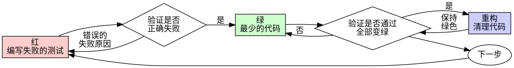

# 测试驱动开发 (TDD)

## 概述

先写测试。看着它失败。编写最少的代码以通过测试。

**核心原则：** 如果你没有看着测试失败，你就不知道它是否测试了正确的内容。

**违反规则的字面意思就是违反规则的精神实质。**

## 何时使用

**始终使用：**

- 新功能
- 错误修复
- 重构
- 行为变更

**例外情况（询问你的人类伙伴）：**

- 一次性原型
- 生成的代码
- 配置文件

想着“就这一次跳过 TDD”？停下。那是自欺欺人。

## 铁律

```
没有先失败的测试，就不写生产代码
```

在测试之前写了代码？删掉它。重新开始。

**没有例外：**

- 不要将其保留为“参考”
- 不要在编写测试时“调整”它
- 不要看它
- 删除意味着彻底删除

从测试开始重新实现。仅此而已。

## 红-绿-重构



### 红 - 编写失败的测试

编写一个最小的测试，展示应该发生什么。

<Good>
```typescript
test('失败的操作重试 3 次', async () => {
  let attempts = 0;
  const operation = () => {
    attempts++;
    if (attempts < 3) throw new Error('fail');
    return 'success';
  };

const result = await retryOperation(operation);

expect(result).toBe('success');
expect(attempts).toBe(3);
});

````
名称清晰，测试真实行为，只测一件事
</Good>

<Bad>
```typescript
test('重试有效', async () => {
  const mock = jest.fn()
    .mockRejectedValueOnce(new Error())
    .mockRejectedValueOnce(new Error())
    .mockResolvedValueOnce('success');
  await retryOperation(mock);
  expect(mock).toHaveBeenCalledTimes(3);
});
````

名称模糊，测试的是模拟对象而非代码
</Bad>

**要求：**

- 一个行为
- 清晰的名称
- 真实代码（除非不可避免，否则不使用模拟对象）

### 验证红 - 看着它失败

**强制要求。绝不可跳过。**

```bash
npm test path/to/test.test.ts
```

确认：

- 测试失败（而不是报错）
- 失败信息符合预期
- 失败是因为功能缺失（而不是拼写错误）

**测试通过了？** 你正在测试现有的行为。修正测试。

**测试报错了？** 修复错误，重新运行直到它正确失败。

### 绿 - 最少的代码

编写通过测试的最简单代码。

<Good>
```typescript
async function retryOperation<T>(fn: () => Promise<T>): Promise<T> {
  for (let i = 0; i < 3; i++) {
    try {
      return await fn();
    } catch (e) {
      if (i === 2) throw e;
    }
  }
  throw new Error('unreachable');
}
```
刚好足以通过测试
</Good>

<Bad>
```typescript
async function retryOperation<T>(
  fn: () => Promise<T>,
  options?: {
    maxRetries?: number;
    backoff?: 'linear' | 'exponential';
    onRetry?: (attempt: number) => void;
  }
): Promise<T> {
  // YAGNI (You Ain't Gonna Need It - 你可能不需要它)
}
```
过度设计
</Bad>

不要添加功能、重构其他代码，或在测试之外“改进”代码。

### 验证绿 - 看着它通过

**强制要求。**

```bash
npm test path/to/test.test.ts
```

确认：

- 测试通过
- 其他测试仍然通过
- 输出干净（无错误、无警告）

**测试失败？** 修复代码，而不是测试。

**其他测试失败？** 立即修复。

### 重构 - 清理

仅在变绿之后：

- 消除重复
- 改进命名
- 提取辅助函数

保持测试通过。不要添加新行为。

### 重复

为下一个功能编写下一个失败的测试。

## 好的测试

| 质量         | 好                                   | 坏                                 |
| ------------ | ------------------------------------ | ---------------------------------- |
| **最小化**   | 只做一件事。名称中有“和”？把它拆开。 | `test('验证邮箱、域名和空白字符')` |
| **清晰**     | 名称描述行为                         | `test('test1')`                    |
| **展示意图** | 演示期望的 API                       | 掩盖了代码应该做什么               |

## 为什么顺序很重要

**“我会在之后写测试来验证它是否有效”**

代码之后写的测试会立即通过。立即通过证明不了什么：

- 可能测试了错误的东西
- 可能测试的是实现细节，而不是行为
- 可能遗漏了你忘记的边缘情况
- 你从未看到它捕获过错误

测试优先迫使你看测试失败，从而证明它确实在测试某些东西。

**“我已经手动测试了所有边缘情况”**

手动测试是随意的。你以为你测试了一切，但：

- 没有记录你测试了什么
- 代码更改时无法重新运行
- 在压力下容易遗漏情况
- “我试的时候是好的” ≠ 全面覆盖

自动化测试是系统性的。它们每次都以相同的方式运行。

**“删除 X 小时的工作成果是浪费”**

这是沉没成本谬误。时间已经过去了。你现在的选择是：

- 删除并用 TDD 重写（再花 X 小时，高置信度）
- 保留它并在事后添加测试（30 分钟，低置信度，可能有 bug）

真正的“浪费”是保留你无法信任的代码。没有真实测试的可运行代码是技术债务。

**“TDD 是教条主义的，务实意味着适应”**

TDD 就是务实：

- 在提交前发现 bug（比事后调试更快）
- 防止回归（测试能立即捕捉破坏）
- 记录行为（测试展示如何使用代码）
- 支持重构（自由更改，测试捕捉破坏）

所谓的“务实”捷径 = 在生产环境中调试 = 更慢。

**“事后测试能达到相同的目标 - 重要的是精神而不是形式”**

不。事后测试回答“这是做什么的？” 测试优先回答“这应该做什么？”

事后测试受你的实现偏见影响。你测试的是你构建的东西，而不是需求的东西。你验证的是记忆中的边缘情况，而不是发现的情况。

测试优先迫使你在实现前发现边缘情况。事后测试验证你是否记住了一切（你没记住）。

事后花 30 分钟写测试 ≠ TDD。你得到了覆盖率，但失去了测试有效的证明。

## 常见的自欺欺人

| 借口                      | 现实                                                    |
| ------------------------- | ------------------------------------------------------- |
| “太简单了不用测试”        | 简单的代码也会出错。测试只需 30 秒。                    |
| “我会在之后测试”          | 测试立即通过证明不了什么。                              |
| “事后测试能达到相同目标”  | 事后测试 = “这是做什么的？” 测试优先 = “这应该做什么？” |
| “已经手动测试过了”        | 随意 ≠ 系统。没有记录，无法重新运行。                   |
| “删除 X 小时的工作是浪费” | 沉没成本谬误。保留未经验证的代码是技术债务。            |
| “保留作为参考，先写测试”  | 你会调整它的。那就是事后测试。删除意味着彻底删除。      |
| “需要先探索一下”          | 可以。扔掉探索成果，从 TDD 开始。                       |
| “测试很难 = 设计不清晰”   | 倾听测试的声音。难以测试 = 难以使用。                   |
| “TDD 会拖慢我”            | TDD 比调试快。务实 = 测试优先。                         |
| “手动测试更快”            | 手动测试不能证明边缘情况。每次更改你都要重新测试。      |
| “现有代码没有测试”        | 你正在改进它。为现有代码添加测试。                      |

## 危险信号 - 停下并重新开始

- 代码在测试之前
- 测试在实现之后
- 测试立即通过
- 无法解释测试为何失败
- “稍后”添加测试
- 自欺欺人说“就这一次”
- “我已经手动测试过了”
- “事后测试能达到相同目的”
- “重要的是精神而不是形式”
- “保留作为参考”或“调整现有代码”
- “已经花了 X 小时，删除是浪费”
- “TDD 是教条主义，我在务实”
- “这次情况不同，因为……”

**所有这些意味着：删除代码。从 TDD 重新开始。**

## 示例：错误修复

**错误：** 接受了空邮箱

**红**

```typescript
test('拒绝空邮箱', async () => {
  const result = await submitForm({ email: '' });
  expect(result.error).toBe('Email required');
});
```

**验证红**

```bash
$ npm test
FAIL: expected 'Email required', got undefined
```

**绿**

```typescript
function submitForm(data: FormData) {
  if (!data.email?.trim()) {
    return { error: 'Email required' };
  }
  // ...
}
```

**验证绿**

```bash
$ npm test
PASS
```

**重构**
如果需要，为多个字段提取验证逻辑。

## 验证清单

在标记工作完成之前：

- [ ] 每个新函数/方法都有测试
- [ ] 在实现前看着每个测试失败
- [ ] 每个测试都因预期原因失败（功能缺失，而非拼写错误）
- [ ] 编写了通过每个测试的最少代码
- [ ] 所有测试都通过
- [ ] 输出干净（无错误、无警告）
- [ ] 测试使用真实代码（仅在不可避免时使用模拟对象）
- [ ] 覆盖了边缘情况和错误

无法勾选所有框？你跳过了 TDD。重新开始。

## 遇到困难时

| 问题             | 解决方案                                       |
| ---------------- | ---------------------------------------------- |
| 不知道如何测试   | 写出你希望的 API。先写断言。询问你的人类伙伴。 |
| 测试太复杂       | 设计太复杂。简化接口。                         |
| 必须模拟所有东西 | 代码耦合度太高。使用依赖注入。                 |
| 测试设置庞大     | 提取辅助函数。仍然复杂？简化设计。             |

## 与调试集成

发现 Bug？编写复现该错误的失败测试。遵循 TDD 循环。测试证明修复有效并防止回归。

永远不要在没有测试的情况下修复 bug。

## 测试反模式

当添加模拟对象或测试工具时，阅读 @testing-anti-patterns.md 以避免常见陷阱：

- 测试模拟行为而不是真实行为
- 向生产类添加仅用于测试的方法
- 在不理解依赖关系的情况下进行模拟

## 最终规则

```
生产代码 → 测试存在且先失败
否则 → 不是 TDD
```

未经你的人类伙伴许可，没有例外。
