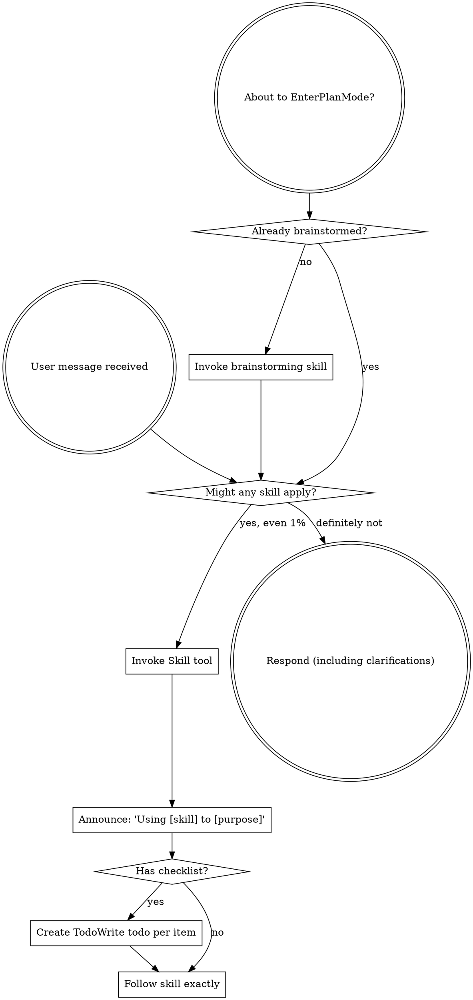

<SUBAGENT-STOP>
如果你是被派遣作为子代理（subagent）来执行特定任务的，请跳过此技能。
</SUBAGENT-STOP>

<EXTREMELY-IMPORTANT>
如果你认为某项技能有哪怕 1% 的可能性适用于你当前的操作，你绝对必须调用该技能。

如果某项技能适用于你的任务，你没有选择的余地。你必须使用它。

这没有商量余地。这不是可选项。你不能靠自我辩解来逃避这一条。
</EXTREMELY-IMPORTANT>

## 指令优先级

Superpowers 技能会覆盖默认的系统提示词行为，但**用户指令始终具有最高优先级**：

1. **用户的明确指令**（CLAUDE.md、GEMINI.md、AGENTS.md、直接请求）——最高优先级
2. **Superpowers 技能**——在与默认系统行为冲突时进行覆盖
3. **默认系统提示词**——最低优先级

如果 CLAUDE.md、GEMINI.md 或 AGENTS.md 指出“不要使用 TDD”，而某项技能要求“始终使用 TDD”，请遵循用户的指令。用户拥有控制权。

## 如何访问技能

**在 Claude Code 中：** 使用 `Skill` 工具。当你调用一项技能时，其内容会被加载并呈现给你——请直接遵循它。切勿对技能文件使用 Read 工具。

**在 Copilot CLI 中：** 使用 `skill` 工具。技能会从已安装的插件中自动发现。`skill` 工具的工作方式与 Claude Code 的 `Skill` 工具相同。

**在 Gemini CLI 中：** 技能通过 `activate_skill` 工具激活。Gemini 会在会话开始时加载技能元数据，并在需要时按需激活完整内容。

**在其他环境中：** 请查阅你所在平台的文档，了解如何加载技能。

## 平台适配

技能使用 Claude Code 的工具命名。非 CC 平台：请参阅 `references/copilot-tools.md`（Copilot CLI）、`references/codex-tools.md`（Codex）以获取工具对应关系。Gemini CLI 用户会通过 GEMINI.md 自动加载工具映射。

# 使用技能

## 核心规则

**在任何回复或操作之前，先调用相关或请求的技能。** 即使某项技能只有 1% 的适用可能性，你也应该调用该技能进行确认。如果调用后发现某项技能不适用于当前情况，你则无需使用它。

## 警示信号

如果出现以下想法，请立即停止——你正在自我合理化：

| 想法                       | 实际情况                                     |
| -------------------------- | -------------------------------------------- |
| “这只是个简单的问题”       | 问题也是任务。检查是否有适用技能。           |
| “我需要先获取更多上下文”   | 技能检查必须在澄清性问题之前进行。           |
| “让我先探索一下代码库”     | 技能会告诉你该如何探索。请先检查。           |
| “我可以快速查看 git/文件”  | 文件缺乏对话上下文。请先检查是否有适用技能。 |
| “让我先收集一下信息”       | 技能会告诉你该如何收集信息。                 |
| “这不需要正式的技能流程”   | 如果存在相关技能，请使用它。                 |
| “我记得这个技能”           | 技能会更新演进。请阅读当前版本。             |
| “这不算作一项任务”         | 有操作就等于有任务。检查是否有适用技能。     |
| “用这个技能有点杀鸡用牛刀” | 简单的事情也会变得复杂。请使用它。           |
| “我就先做这一件事”         | 在做任何事之前先检查。                       |
| “这感觉很有成效”           | 缺乏纪律的行动会浪费时间。技能能防止这一点。 |
| “我知道那是什么意思”       | 知道概念 ≠ 使用该技能。请调用它。            |

## 技能优先级

当多个技能可能适用时，请按以下顺序使用：

1. **流程类技能优先**（如 brainstorming、debugging）——这些技能决定**如何**处理任务
2. **实现类技能次之**（如 frontend-design、mcp-builder）——这些技能指导具体执行

“让我们构建 X” → 先使用 brainstorming，再使用实现类技能。
“修复这个 bug” → 先使用 debugging，再使用领域特定技能。

## 技能类型

**严格型**（TDD、debugging）：严格遵循。不要为了适应环境而放弃纪律性。

**灵活型**（patterns）：根据上下文调整原则。

技能本身会说明它属于哪种类型。

## 用户指令

指令规定的是**做什么（WHAT）**，而不是**怎么做（HOW）**。“添加 X”或“修复 Y”并不意味着可以跳过标准工作流。
