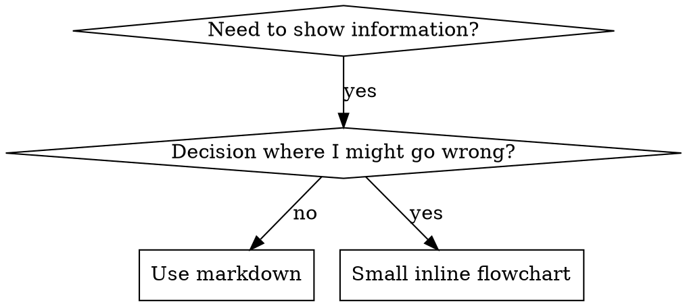

# 编写技能

## 概述

**编写技能是将测试驱动开发（TDD）应用于流程文档。**

**个人技能存储在代理特定的目录中（Claude Code 为 `~/.claude/skills`，Codex 为 `~/.agents/skills/`）**

你编写测试用例（带有子代理的压力场景），观察它们失败（基线行为），编写技能（文档），观察测试通过（代理遵守规则），然后重构（堵塞漏洞）。

**核心原则：** 如果你没有观察到代理在没有该技能的情况下失败，你就无法确定该技能是否教授了正确的内容。

**必备背景：** 在使用此技能之前，你**必须**理解 `superpowers:test-driven-development`。该技能定义了基本的 RED-GREEN-REFACTOR（红-绿-重构）循环。本技能将 TDD 适配于文档编写。

**官方指南：** 有关 Anthropic 官方的技能创作最佳实践，请参阅 `anthropic-best-practices.md`。本文档提供了补充本技能中 TDD 聚焦方法的额外模式和指南。

## 什么是技能？

**技能**是经过验证的技术、模式或工具的参考指南。技能帮助未来的 Claude 实例查找并应用有效的方法。

**技能是：** 可复用的技术、模式、工具、参考指南

**技能不是：** 关于你曾经如何解决某个问题的叙述

## 技能的 TDD 映射

| TDD 概念             | 技能创建                               |
| -------------------- | -------------------------------------- |
| **测试用例**         | 带有子代理的压力场景                   |
| **生产代码**         | 技能文档 (SKILL.md)                    |
| **测试失败 (RED)**   | 代理在没有技能的情况下违反规则（基线） |
| **测试通过 (GREEN)** | 代理在存在技能时遵守规则               |
| **重构**             | 在保持合规性的同时堵塞漏洞             |
| **先写测试**         | 在编写技能**之前**运行基线场景         |
| **观察失败**         | 记录代理使用的确切合理化借口           |
| **最小化代码**       | 编写针对这些特定违规行为的技能         |
| **观察通过**         | 验证代理现在是否合规                   |
| **重构循环**         | 发现新的合理化借口 → 堵塞 → 重新验证   |

整个技能创建过程遵循 RED-GREEN-REFACTOR 循环。

## 何时创建技能

**在以下情况创建：**

- 该技术对你来说并非直观明显
- 你会在不同项目中再次参考此内容
- 模式具有广泛适用性（非项目特定）
- 其他人也会受益

**不要为以下情况创建：**

- 一次性解决方案
- 在其他地方已有良好文档记录的标准实践
- 项目特定的约定（放入 `CLAUDE.md`）
- 机械性约束（如果可以通过正则表达式/验证强制执行，请自动化它——将文档保留给需要判断的情况）

## 技能类型

### 技术 (Technique)

包含具体步骤的具体方法（如 `condition-based-waiting`、`root-cause-tracing`）

### 模式 (Pattern)

思考问题的方式（如 `flatten-with-flags`、`test-invariants`）

### 参考 (Reference)

API 文档、语法指南、工具文档（办公文档）

## 目录结构

```
skills/
  skill-name/
    SKILL.md              # 主要参考（必需）
    supporting-file.*     # 仅在需要时提供
```

**扁平命名空间** - 所有技能位于一个可搜索的命名空间中

**单独文件用于：**

1. **重型参考**（100+ 行）- API 文档、综合语法
2. **可复用工具** - 脚本、实用程序、模板

**保持内联：**

- 原则和概念
- 代码模式（< 50 行）
- 其他所有内容

## SKILL.md 结构

**前置元数据 (YAML)：**

- 两个必需字段：`name` 和 `description`（所有支持字段参见 [agentskills.io/specification](https://agentskills.io/specification)）
- 总字符数最多 1024 个
- `name`：仅使用字母、数字和连字符（无括号、特殊字符）
- `description`：第三人称，仅描述**何时**使用（**不**描述它做什么）
  - 以 "Use when..."（当...时使用）开头，侧重于触发条件
  - 包括具体的症状、情境和上下文
  - **切勿总结技能的流程或工作流**（参见 CSO 部分了解原因）
  - 尽可能保持在 500 个字符以内

```markdown
---
name: Skill-Name-With-Hyphens
description: Use when [specific triggering conditions and symptoms]
---

# 技能名称

## 概述

这是什么？用 1-2 句话概括核心原则。

## 何时使用

[如果决策不明显，提供小型内联流程图]

包含症状和用例的项目符号列表
何时**不**使用

## 核心模式（适用于技术/模式）

前后代码对比

## 快速参考

用于扫描常见操作的表格或项目符号

## 实现

简单模式的内联代码
重型参考或可复用工具链接到文件

## 常见错误

出错情况及修复方法

## 实际影响（可选）

具体成果
```

## Claude 搜索优化 (CSO)

**对发现至关重要：** 未来的 Claude 需要**找到**你的技能

### 1. 丰富的描述字段

**目的：** Claude 阅读描述以决定为给定任务加载哪些技能。使其能够回答：“我现在应该阅读这个技能吗？”

**格式：** 以 "Use when..."（当...时使用）开头，侧重于触发条件

**关键：描述 = 何时使用，而非技能做什么**

描述应**仅**描述触发条件。**不要**在描述中总结技能的流程或工作流。

**为何重要：** 测试显示，当描述总结技能的工作流时，Claude 可能会遵循描述而不是阅读完整的技能内容。例如，描述说“在任务之间进行代码审查”，导致 Claude 只进行**一次**审查，尽管技能的流程图清楚地显示了**两次**审查（规范合规性然后代码质量）。

当描述改为仅“当在当前会话中执行包含独立任务的实施计划时使用”（无工作流总结）时，Claude 正确阅读了流程图并遵循了两阶段审查过程。

**陷阱：** 总结工作流的描述会创建 Claude 会采取的捷径。技能主体变成了 Claude 跳过的文档。

```yaml
# ❌ 错误：总结工作流 - Claude 可能会遵循此描述而不是阅读技能
description: Use when executing plans - dispatches subagent per task with code review between tasks

# ❌ 错误：过多的流程细节
description: Use for TDD - write test first, watch it fail, write minimal code, refactor

# ✅ 正确：仅触发条件，无工作流总结
description: Use when executing implementation plans with independent tasks in the current session

# ✅ 正确：仅触发条件
description: Use when implementing any feature or bugfix, before writing implementation code
```

**内容：**

- 使用表明此技能适用的具体触发器、症状和情境
- 描述*问题*（竞态条件、不一致行为），而非*语言特定的症状*（setTimeout, sleep）
- 除非技能本身是技术特定的，否则保持触发器与技术无关
- 如果技能是技术特定的，请在触发器中明确说明
- 用第三人称书写（注入到系统提示中）
- **切勿总结技能的流程或工作流**

```yaml
# ❌ 错误：太抽象、模糊，未包含何时使用
description: For async testing

# ❌ 错误：第一人称
description: I can help you with async tests when they're flaky

# ❌ 错误：提及技术但技能并非特定于此技术
description: Use when tests use setTimeout/sleep and are flaky

# ✅ 正确：以 "Use when" 开头，描述问题，无工作流
description: Use when tests have race conditions, timing dependencies, or pass/fail inconsistently

# ✅ 正确：具有明确触发器的技术特定技能
description: Use when using React Router and handling authentication redirects
```

### 2. 关键词覆盖

使用 Claude 会搜索的词汇：

- 错误消息："Hook timed out", "ENOTEMPTY", "race condition"
- 症状："flaky"（不稳定）, "hanging"（挂起）, "zombie"（僵尸进程）, "pollution"（污染）
- 同义词："timeout/hang/freeze"（超时/挂起/冻结）, "cleanup/teardown/afterEach"（清理/拆卸/每次之后）
- 工具：实际命令、库名称、文件类型

### 3. 描述性命名

**使用主动语态，动词优先：**

- ✅ `creating-skills` 而非 `skill-creation`
- ✅ `condition-based-waiting` 而非 `async-test-helpers`

### 4. Token 效率（关键）

**问题：** `getting-started` 和经常引用的技能会加载到**每次**对话中。每个 Token 都很重要。

**目标字数：**

- 入门工作流：每个 <150 词
- 频繁加载的技能：总共 <200 词
- 其他技能：<500 词（仍需简洁）

**技巧：**

**将细节移至工具帮助信息：**

```bash
# ❌ 错误：在 SKILL.md 中记录所有标志
search-conversations supports --text, --both, --after DATE, --before DATE, --limit N

# ✅ 正确：引用 --help
search-conversations supports multiple modes and filters. Run --help for details.
```

**使用交叉引用：**

```markdown
# ❌ 错误：重复工作流细节

When searching, dispatch subagent with template...
[20 lines of repeated instructions]

# ✅ 正确：引用其他技能

Always use subagents (50-100x context savings). REQUIRED: Use [other-skill-name] for workflow.
```

**压缩示例：**

```markdown
# ❌ 错误：冗长的示例（42 词）

your human partner: "How did we handle authentication errors in React Router before?"
You: I'll search past conversations for React Router authentication patterns.
[Dispatch subagent with search query: "React Router authentication error handling 401"]

# ✅ 正确：最小化示例（20 词）

Partner: "How did we handle auth errors in React Router?"
You: Searching...
[Dispatch subagent → synthesis]
```

**消除冗余：**

- 不要重复交叉引用技能中已有的内容
- 不要解释从命令中显而易见的内容
- 不要包含同一模式的多个示例

**验证：**

```bash
wc -w skills/path/SKILL.md
# getting-started workflows: aim for <150 each
# Other frequently-loaded: aim for <200 total
```

**以你所做的操作或核心洞察命名：**

- ✅ `condition-based-waiting` > `async-test-helpers`
- ✅ `using-skills` 而非 `skill-usage`
- ✅ `flatten-with-flags` > `data-structure-refactoring`
- ✅ `root-cause-tracing` > `debugging-techniques`

**动名词 (-ing) 非常适合描述过程：**

- `creating-skills`, `testing-skills`, `debugging-with-logs`
- 主动语态，描述你正在采取的行动

### 4. 交叉引用其他技能

**在编写引用其他技能的文档时：**

仅使用技能名称，并带有明确的必需标记：

- ✅ 好：`**REQUIRED SUB-SKILL:** Use superpowers:test-driven-development`
- ✅ 好：`**REQUIRED BACKGROUND:** You MUST understand superpowers:systematic-debugging`
- ❌ 坏：`See skills/testing/test-driven-development`（不清楚是否必需）
- ❌ 坏：`@skills/testing/test-driven-development/SKILL.md`（强制加载，消耗上下文）

**为何不使用 @ 链接：** `@` 语法会立即强制加载文件，在你需要之前就消耗了 200k+ 上下文。

## 流程图使用



**仅在以下情况使用流程图：**

- 非显而易见的决策点
- 你可能过早停止的过程循环
- “何时使用 A 与 B”的决策

**切勿在以下情况使用流程图：**

- 参考材料 → 表格、列表
- 代码示例 → Markdown 代码块
- 线性指令 → 编号列表
- 没有语义意义的标签（step1, helper2）

参见 `@graphviz-conventions.dot` 了解 graphviz 样式规则。

**为你的人类合作伙伴可视化：** 使用此目录中的 `render-graphs.js` 将技能的流程图渲染为 SVG：

```bash
./render-graphs.js ../some-skill           # 每个图表单独生成
./render-graphs.js ../some-skill --combine # 所有图表合并为一个 SVG
```

## 代码示例

**一个优秀的示例胜过许多平庸的示例**

选择最相关的语言：

- 测试技术 → TypeScript/JavaScript
- 系统调试 → Shell/Python
- 数据处理 → Python

**好的示例：**

- 完整且可运行
- 注释良好，解释**为什么**
- 来自真实场景
- 清晰展示模式
- 易于调整（而非通用模板）

**不要：**

- 用 5+ 种语言实现
- 创建填空式模板
- 编写牵强的示例

你擅长移植代码——一个伟大的示例就足够了。

## 文件组织

### 自包含技能

```
defense-in-depth/
  SKILL.md    # 所有内容内联
```

适用情况：所有内容合适，无需重型参考

### 带有可复用工具的技能

```
condition-based-waiting/
  SKILL.md    # 概述 + 模式
  example.ts  # 可供调整的工作助手代码
```

适用情况：工具是可复用代码，而不仅仅是叙述

### 带有重型参考的技能

```
pptx/
  SKILL.md       # 概述 + 工作流
  pptxgenjs.md   # 600 行 API 参考
  ooxml.md       # 500 行 XML 结构
  scripts/       # 可执行工具
```

适用情况：参考材料太大，无法内联

## 铁律（与 TDD 相同）

```
没有失败的测试，就没有技能
```

这适用于**新**技能和**现有**技能的编辑。

先写技能后测试？删除它。重新开始。
编辑技能而不测试？同样是违规。

**没有例外：**

- 不适用于“简单添加”
- 不适用于“仅添加一个部分”
- 不适用于“文档更新”
- 不要将未经测试的更改作为“参考”保留
- 不要在运行测试时“调整”
- 删除意味着彻底删除

**必备背景：** `superpowers:test-driven-development` 技能解释了为何这很重要。同样的原则适用于文档。

## 测试所有技能类型

不同的技能类型需要不同的测试方法：

### 纪律强化型技能（规则/要求）

**示例：** TDD、完成前验证、编码前设计

**测试方法：**

- 学术性问题：他们理解规则吗？
- 压力场景：他们在压力下是否遵守？
- 多重压力组合：时间 + 沉没成本 + 疲惫
- 识别合理化借口并添加明确的反驳

**成功标准：** 代理在最大压力下遵循规则

### 技术型技能（操作指南）

**示例：** `condition-based-waiting`、`root-cause-tracing`、`defensive-programming`

**测试方法：**

- 应用场景：他们能正确应用技术吗？
- 变体场景：他们能处理边缘情况吗？
- 信息缺失测试：指令是否有缺口？

**成功标准：** 代理成功将技术应用于新场景

### 模式型技能（思维模型）

**示例：** `reducing-complexity`、信息隐藏概念

**测试方法：**

- 识别场景：他们能识别模式何时适用吗？
- 应用场景：他们能使用思维模型吗？
- 反例：他们知道何时**不**应用吗？

**成功标准：** 代理正确识别何时/如何应用模式

### 参考型技能（文档/API）

**示例：** API 文档、命令参考、库指南

**测试方法：**

- 检索场景：他们能找到正确的信息吗？
- 应用场景：他们能正确使用找到的信息吗？
- 缺口测试：是否涵盖了常见用例？

**成功标准：** 代理找到并正确应用参考信息

## 跳过测试的常见合理化借口

| 借口               | 现实                                            |
| ------------------ | ----------------------------------------------- |
| “技能显然很清楚”   | 对你清楚 ≠ 对其他代理清楚。测试它。             |
| “这只是参考”       | 参考可能有缺口、不清楚的部分。测试检索。        |
| “测试是大材小用”   | 未经测试的技能总有问题。15 分钟测试节省数小时。 |
| “出现问题我再测试” | 问题 = 代理无法使用技能。在部署**前**测试。     |
| “测试太繁琐”       | 测试比在生产环境中调试糟糕的技能更轻松。        |
| “我确信它很好”     | 过度自信保证会有问题。无论如何都要测试。        |
| “学术审查就够了”   | 阅读 ≠ 使用。测试应用场景。                     |
| “没时间测试”       | 部署未经测试的技能会在后期修复时浪费更多时间。  |

**所有这些意味着：在部署前测试。没有例外。**

## 防止技能被合理化利用

强化纪律的技能（如 TDD）需要抵抗合理化。代理很聪明，在压力下会寻找漏洞。

**心理学注记：** 理解说服技巧**为何**有效有助于你系统地应用它们。参见 `persuasion-principles.md` 了解研究基础（Cialdini, 2021; Meincke et al., 2025），涉及权威、承诺、稀缺性、社会认同和统一性原则。

### 明确堵塞每个漏洞

不要仅仅陈述规则——禁止特定的变通方法：

<Bad>
```markdown
Write code before test? Delete it.
```
</Bad>

<Good>
```markdown
Write code before test? Delete it. Start over.

**No exceptions:**

- Don't keep it as "reference"
- Don't "adapt" it while writing tests
- Don't look at it
- Delete means delete

````
</Good>

### 解决“精神与字面”争论

尽早添加基本原则：

```markdown
**Violating the letter of the rules is violating the spirit of the rules.**
````

这切断了一整类“我在遵循精神”的合理化借口。

### 构建合理化表格

从基线测试中捕获合理化借口（参见下面的测试部分）。代理提出的每个借口都放入表格中：

```markdown
| Excuse                           | Reality                                                                 |
| -------------------------------- | ----------------------------------------------------------------------- |
| "Too simple to test"             | Simple code breaks. Test takes 30 seconds.                              |
| "I'll test after"                | Tests passing immediately prove nothing.                                |
| "Tests after achieve same goals" | Tests-after = "what does this do?" Tests-first = "what should this do?" |
```

### 创建红旗列表

使代理在合理化时能够轻松自查：

```markdown
## Red Flags - STOP and Start Over

- Code before test
- "I already manually tested it"
- "Tests after achieve the same purpose"
- "It's about spirit not ritual"
- "This is different because..."

**All of these mean: Delete code. Start over with TDD.**
```

### 更新 CSO 以包含违规症状

在描述中添加你**即将**违反规则时的症状：

```yaml
description: use when implementing any feature or bugfix, before writing implementation code
```

## 技能的 RED-GREEN-REFACTOR

遵循 TDD 循环：

### RED：编写失败的测试（基线）

在**没有**技能的情况下，使用子代理运行压力场景。记录确切行为：

- 他们做出了什么选择？
- 他们使用了什么合理化借口（逐字记录）？
- 哪些压力触发了违规行为？

这是“观察测试失败”——在编写技能之前，你必须看到代理自然的行为。

### GREEN：编写最小化技能

编写针对那些特定合理化借口的技能。不要为假设情况添加额外内容。

在**有**技能的情况下运行相同场景。代理现在应该遵守规则。

### REFACTOR：堵塞漏洞

代理发现了新的合理化借口？添加明确的反驳。重新测试直到坚不可摧。

**测试方法：** 参见 `@testing-skills-with-subagents.md` 了解完整的测试方法：

- 如何编写压力场景
- 压力类型（时间、沉没成本、权威、疲惫）
- 系统地堵塞漏洞
- 元测试技术

## 反模式

### ❌ 叙述性示例

"In session 2025-10-03, we found empty projectDir caused..."
**为何不好：** 太具体，不可复用

### ❌ 多语言稀释

example-js.js, example-py.py, example-go.go
**为何不好：** 质量平庸，维护负担重

### ❌ 流程图中的代码

```dot
step1 [label="import fs"];
step2 [label="read file"];
```

**为何不好：** 无法复制粘贴，难以阅读

### ❌ 通用标签

helper1, helper2, step3, pattern4
**为何不好：** 标签应具有语义意义

## 停止：在移至下一个技能之前

**在编写**任何**技能后，你**必须**停止并完成部署过程。**

**不要：**

- 批量创建多个技能而不测试每一个
- 在当前技能验证之前移至下一个技能
- 因为“批处理更高效”而跳过测试

**下面的部署清单对**每个**技能都是强制性的。**

部署未经测试的技能 = 部署未经测试的代码。这是对质量标准的违反。

## 技能创建清单（适配 TDD）

**重要：使用 TodoWrite 为下面的**每个**清单项创建待办事项。**

**RED 阶段 - 编写失败的测试：**

- [ ] 创建压力场景（纪律型技能需 3+ 种组合压力）
- [ ] 在**没有**技能的情况下运行场景 - 逐字记录基线行为
- [ ] 识别合理化/失败中的模式

**GREEN 阶段 - 编写最小化技能：**

- [ ] 名称仅使用字母、数字、连字符（无括号/特殊字符）
- [ ] YAML 前置元数据包含必需的 `name` 和 `description` 字段（最多 1024 字符；参见 [spec](https://agentskills.io/specification)）
- [ ] 描述以 "Use when..." 开头，并包含具体的触发器/症状
- [ ] 描述用第三人称书写
- [ ] 全文分布关键词以供搜索（错误、症状、工具）
- [ ] 清晰的概述与核心原则
- [ ] 解决 RED 阶段中确定的具体基线失败
- [ ] 代码内联**或**链接到单独文件
- [ ] 一个优秀的示例（非多语言）
- [ ] 在**有**技能的情况下运行场景 - 验证代理现在是否遵守

**REFACTOR 阶段 - 堵塞漏洞：**

- [ ] 从测试中识别**新**的合理化借口
- [ ] 添加明确的反驳（如果是纪律型技能）
- [ ] 从所有测试迭代中构建合理化表格
- [ ] 创建红旗列表
- [ ] 重新测试直到坚不可摧

**质量检查：**

- [ ] 仅在决策不明显时使用小型流程图
- [ ] 快速参考表格
- [ ] 常见错误部分
- [ ] 无叙述性故事讲述
- [ ] 仅在工具或重型参考时使用支持文件

**部署：**

- [ ] 将技能提交到 git 并推送到你的 fork（如果已配置）
- [ ] 考虑通过 PR 贡献回来（如果广泛有用）

## 发现工作流

未来的 Claude 如何找到你的技能：

1. **遇到问题**（“测试不稳定”）
2. **找到技能**（描述匹配）
3. **扫描概述**（这相关吗？）
4. **阅读模式**（快速参考表格）
5. **加载示例**（仅在实施时）

**为此流程优化** - 尽早且频繁地放置可搜索术语。

## 底线

**创建技能就是流程文档的 TDD。**

同样的铁律：没有失败的测试，就没有技能。
同样的循环：RED（基线）→ GREEN（编写技能）→ REFACTOR（堵塞漏洞）。
同样的好处：更好的质量、更少的意外、坚不可摧的结果。

如果你对代码遵循 TDD，那么对技能也要遵循。这是应用于文档的同样纪律。
